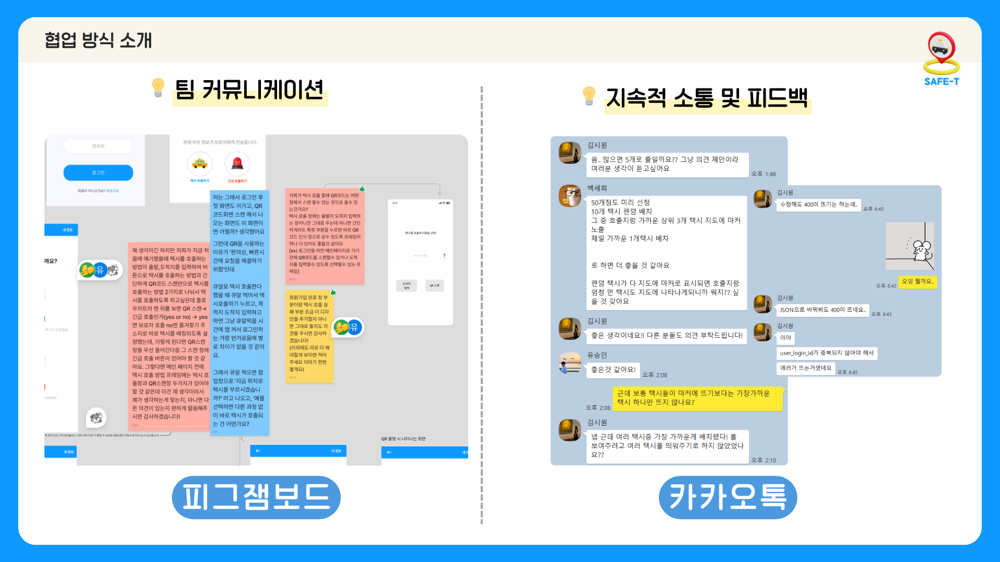

# 🚕SAFE-T


배포 URL : http://safe-t.o-r.kr/

## 팀 소개

멋쟁이사자처럼 인하대학교 12기 해커톤 썸머톤(7/5~7/6) 2팀입니다.

## 팀원 소개


| 김시원 | 김애리 | 백세희 | 유승인 | 이영주 |
| ------ | ------ |------| ------ | ------ |
| BE | FE | BE | FE | FE |
| @seaniiio | @aeli22 | @sae2say | @seung-in-Yoo | @abyss-s |

## 기술 스택

[](https://github.com/msdio/stackticon)
[](https://github.com/msdio/stackticon)
[](https://github.com/msdio/stackticon)

<!--https://msdio.github.io/stackticon/#/-->

## 서비스 소개

빠르고 간편한 디지털 취약 계층 특화 택시 호출 서비스

## 제안 이유

- 늘어나는 취약 계층
  - 현재 우리나라는 취약계층이라 부를수 있는 노인 및 장애인 등의 인구가 급격히 증가하고 있습니다.전체 인구 대비 장애인의 비율은 5.1%, 65세 이상 인구는 17.5%로, 현재도 취약계층이 총 인구의 20% 이상을 차지하고 있고, 2070년이 되면 취약계층의 비율이 50% 이상이 될 것으로 예측됩니다.
- 이로 인한 디지털 격차의 심화
  - 특히 취약계층은 스마트폰 사용 미숙, 화면과 조작 방법의 복잡함으로 인해 디지털 격차가 심화되고 있습니다. 특히 택시 호출 앱 사용이 어려워 즉석에서 택시를 잡으시는 어르신들은 아무리 기다려도 예약택시밖에 보이지 않아서 불편을 겪기도 합니다.
- 시장 분석 및 비즈니스 측면 분석
  - 현재 택시 호출 앱 시장은 꾸준히 성장 중이며, 10년 내에 두 배 이상 규모로 확대될 것으로 예상됩니다. 저희 서비스는 병원, 복지관 등 취약계층이 많이 이용하는 시설과 택시 회사 사이에서 중개 역할을 하며, 기업 및 공공기관과의 연계를 통해 해당 서비스를 홍보하여 확장할 수 있습니다.

## 프로젝트 과정


## 기능


- **반응형 웹/앱**
  - 데스크탑, 태블릿, 휴대폰 모든 기기에서 사용 가능
- **회원가입**
  - 입력란 유효성을 검증받아 안전한 가입 가능
    - 연락처나 이메일 등의 형식이 올바르지 않을 경우, 가입 불가
- **로그인**
  - JWT 기반의 토큰 인증을 통한 안전한 로그인
  - 로그인하지 않으면 기능 이용 불가
- **내 정보 확인**
  - 회원가입에서 사용한 주요 개인정보를 확인
  - 보호자와 주소지 정보 추가 등록 및 확인 가능
- **현 위치에서 택시 호출**
  - 출발지 및 도착지 입력하는 일반적인 호출
  - QR 스캔을 통해 미리 저장한 주소지로 빠르고 간편하게 호출
- **택시 배차**
  - 가장 가까운 택시들의 정보를 수집하여 배차
  - 기사 정보와 요금, 소요 시간 안내
- **보호자 긴급 호출**
  - 위급 상황 시 미리 저장한 보호자에게 즉시 알림

## 실행

```bash
git clone https://github.com/likelion-inha-hackathon-2/Summerthon-FE.git
cd my-app/
npm i
npm run start
```

## 주요 폴더 구조

- apis
  - 사용한 api를 모듈화하여 기능마다 분리
- pages
- components
- assets
  - 이미지, 아이콘 등을 저장하는 폴더
- hooks
  - useForm: 폼 입력란에서 변하는 value들을 간편하게 관리

## 의존성 라이브러리

- `styled-components`: 컴포넌트 스타일링에 사용
- `axios`: 백엔드와 GET, POST하여 데이터 주고 받기 위해 사용
- `buffer, path-browserify, os-browserify`: webpack 모듈 버전 맞추기 위해 사용
- `react-modal`: 주소지 추가, 보호자 추가, 택시 호출 취소할 때 모달 창 사용
- `xml-js`: XML 데이터를 JSON으로 변환

## 외부 API

<aside>
📌 카카오 디벨로퍼스를 중점적으로 활용
</aside>

- [Daum 우편번호 서비스](https://postcode.map.daum.net/guide)
  - 회원가입 시 도로명 주소 검색 가능
- [Kakao Rest API](https://developers.kakao.com/docs/latest/ko/local/dev-guide)
  - 위도,경도와 도로명주소 양방향 변환
- [Kakao 지도 API](https://apis.map.kakao.com/web/guide/#ready)
  - 출발지 → 목적지 길찾기, 경로 표시
- [Kakao 모빌리티 API](https://developers.kakaomobility.com/docs/navi-api/origins/)
  - 다중 출발지 길찾기 API를 활용해 여러 택시들 중 가까운 택시를 배차

## 협업 방식




## 특별히 신경 쓴 부분

> JWT 토큰 인증방식

- BE: 클라이언트에서 서버에 로그인을 요청하면 서버는 access token과 refresh token을 발급하여 클라이언트에게 전송합니다.
- FE: 서버로부터 받은 access token을 변수로 관리하여 요청 헤더에 Authorization 헤더를 추가하고 로컬스토리지에 저장(ex. `Bearer ${accessToken}`)합니다.

> 반응형으로 구현

- 모바일 뿐만 아니라 데스크탑에서도 서비스를 제공하여 기존 택시 서비스와의 차별점을 시사합니다.

### FE

> 컴포넌트 설계

- 단일 책임의 원칙
  - 유지보수를 용이하게 하기 위해 하나의 컴포넌트는 하나의 일을 수행하도록 최대한 분리하고자 했습니다.
  - 예를 들면 서비스 특성 상 폼 입력이 많아 input 레이블과 입력창을 하나의 컴포넌트로 만들어서 라벨 name만 바꿔서 사용할 수 있도록 구현했습니다.

### BE

> 택시 호출 시스템

출발지인 인하대 근처에 택시들을 랜덤하게 생성하고, 길찾기 API를 이용하여 출발지로부터 가장 가까운 택시를 배정합니다. 택시 기사 정보와 함께 택시가 도착하는 데에 걸리는 예상 시간과 및 출발지로부터 목적지까지의 예상 비용을 return합니다.

## 더 발전시킬 부분이 있다면?

- 이번에 구현하지 못한 부분들을 생각해보면 현위치 받아오기, 다중 경유지 길찾기 API 등을 활용하여 택시 운전하는 기사님들도 우리 서비스를 활용해 호출 수락하기, 결제 기능 등이 있었다.

  - 특히 API를 이용하여 현재 위치를 받아오려고 시도했으나, 인천에서 현 위치를 불러옴에도 불구하고 미국으로 위치가 뜨는 등 오차가 너무 커서 그 부분은 보류했다. 구현을 제대로 못한 건 아쉽지만 특정 지역 반경 내에서 서비스한다면 충분히 상업적인 가치가 있을 것이라고 생각한다.

- 코드 포매터의 부재

  - Prettier 익스텐션 설정이 서로 달라서 혼란이 생겼던 적이 있다. 다음에는 코드포매터를 통일하거나 미리 세팅하여 팀원들 간 동일한 환경에서 작업할 수 있도록 해야겠다.

- 코드 네이밍 컨벤션의 부재

  - 따로 스타일 가이드를 지정하거나 네이밍 규칙을 정한 적이 없었다. 이로 인해 서로 같은 파일이나 변수의 이름을 다른 이름으로 정하여 수정하는 시간이 불필요하게 늘었다.

- 늦은 레이아웃 리팩토링
  - 해커톤 전날 급하게 프로젝트를 반응형으로 수정하게 되었다. 이는 디자인 기획 시
