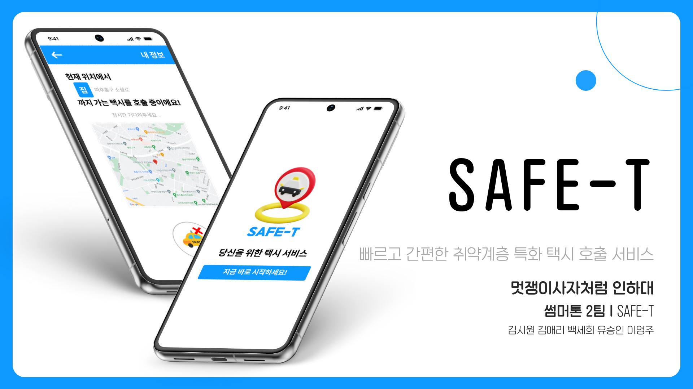
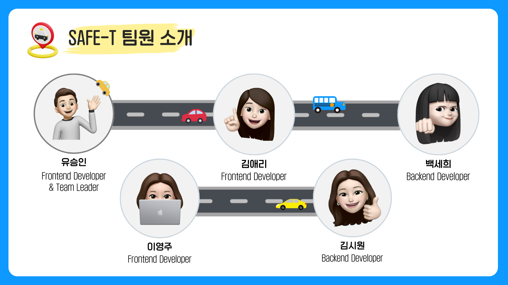
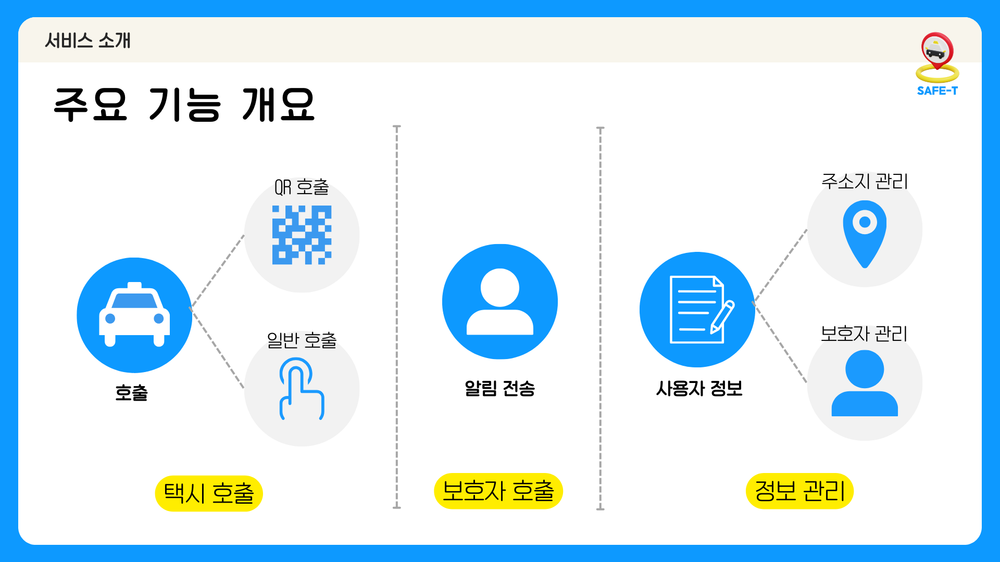
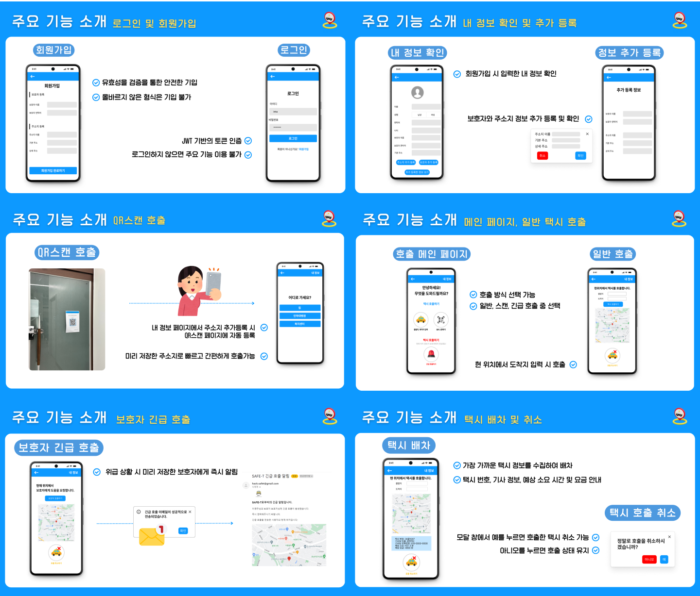
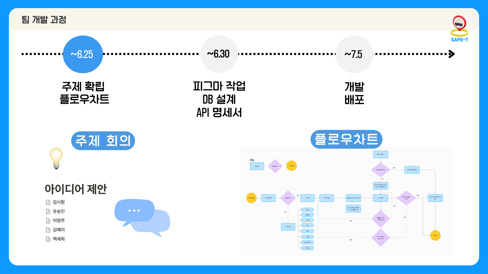
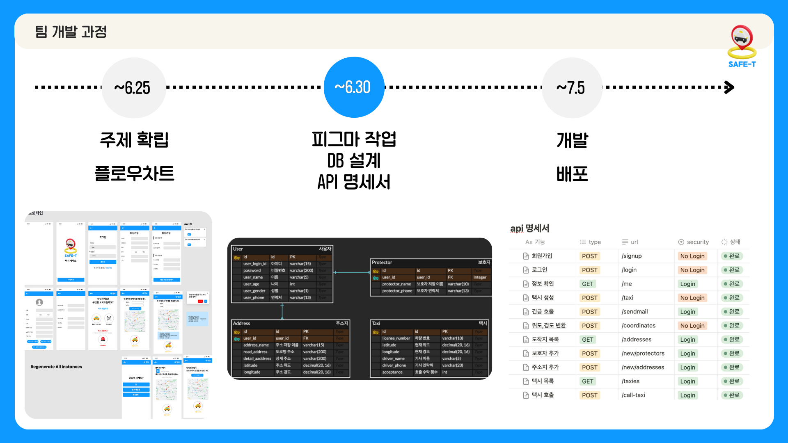
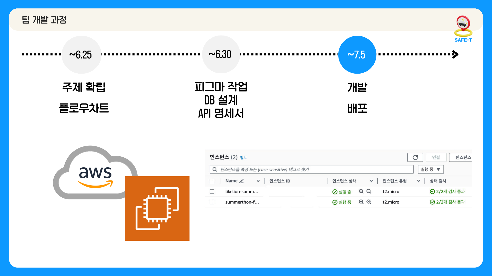
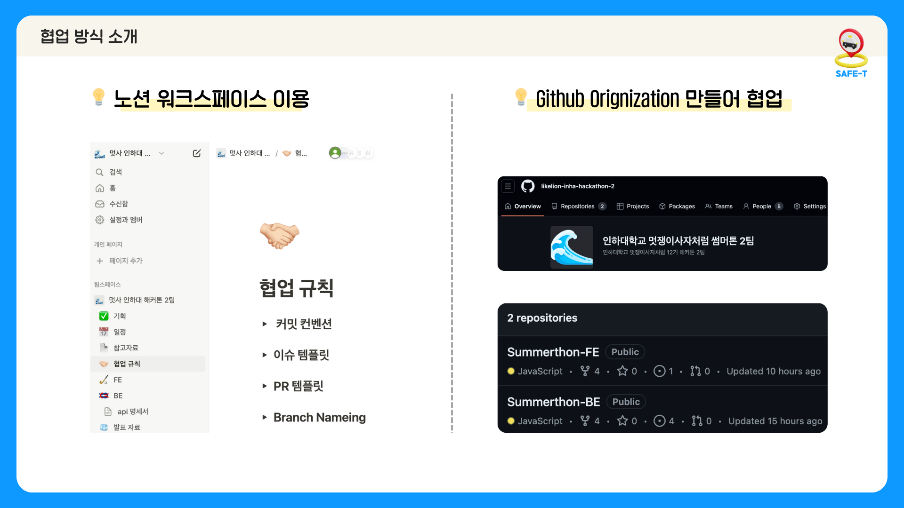
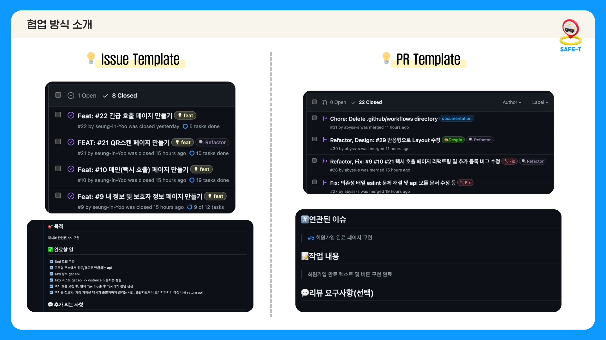

# 🚕SAFE-T


배포 URL : http://safe-t.o-r.kr/

## 팀 소개

멋쟁이사자처럼 인하대학교 12기 해커톤 썸머톤(7/5~7/6) 2팀입니다.

## 팀원 소개


| 김시원 | 김애리 | 백세희 | 유승인 | 이영주 |
| ------ | ------ |------| ------ | ------ |
|  |  ||  |  |
| BE | FE | BE | FE | FE |
| [@seaniiio](https://github.com/seaniiio) | [@aeli22](https://github.com/aeli22) | [@sae2say](https://github.com/sae2say) | [@seung-in-Yoo](https://github.com/seung-in-Yoo) | [@abyss-s](https://github.com/abyss-s) |

## 기술 스택

[](https://github.com/msdio/stackticon)
[](https://github.com/msdio/stackticon)
[](https://github.com/msdio/stackticon)

<!--https://msdio.github.io/stackticon/#/-->

## 서비스 소개

빠르고 간편한 디지털 취약 계층 특화 택시 호출 서비스, **SAFE-T**입니다.

## 기능



## 주요 기능



## 실행 방법

```bash
git clone https://github.com/likelion-inha-hackathon-2/Summerthon-FE.git
cd my-app/
npm i
npm run start
```

## 폴더 구조

```
📦src
 ┣ 📂apis
 ┃ ┣ 📜authApi.js
 ┃ ┣ 📜emailApi.js
 ┃ ┣ 📜kakaoApi.js
 ┃ ┗ 📜taxiApi.js
 ┣ 📂assets
 ┃ ┣ 📂icons
 ┃ ┃ ┗ 📜arrow.png
 ┃ ┣ 📂images
 ┃ ┃ ┣ 📜button-call.png
 ┃ ┃ ┣ 📜button-cancel.png
 ┃ ┃ ┣ 📜button-emer.png
 ┃ ┃ ┣ 📜button-scan.png
 ┃ ┃ ┣ 📜logo.png
 ┃ ┃ ┣ 📜taxi.png
 ┃ ┃ ┗ 📜user.png
 ┃ ┗ 📜image.js
 ┣ 📂components
 ┃ ┣ 📂Button
 ┃ ┃ ┣ 📜AddButton.jsx
 ┃ ┃ ┣ 📜Button.jsx
 ┃ ┃ ┗ 📜CancleButton.jsx
 ┃ ┣ 📂Container
 ┃ ┃ ┗ 📜Container.jsx
 ┃ ┣ 📂Flex
 ┃ ┃ ┗ 📜Flex.jsx
 ┃ ┣ 📂Header
 ┃ ┃ ┣ 📜Header1.jsx
 ┃ ┃ ┗ 📜Header2.jsx
 ┃ ┣ 📂Image
 ┃ ┃ ┗ 📜Image.jsx
 ┃ ┣ 📂Input
 ┃ ┃ ┗ 📜Input.jsx
 ┃ ┣ 📂Layout
 ┃ ┃ ┗ 📜Layout.jsx
 ┃ ┣ 📂Map
 ┃ ┃ ┗ 📜Map.jsx
 ┃ ┣ 📂Modal
 ┃ ┃ ┣ 📜AddAddressModal.jsx
 ┃ ┃ ┣ 📜AddProtectorModal.jsx
 ┃ ┃ ┗ 📜Modal.jsx
 ┃ ┣ 📂Radio
 ┃ ┃ ┗ 📜Radio.jsx
 ┃ ┣ 📂Taxi
 ┃ ┃ ┗ 📜Taxi.jsx
 ┃ ┗ 📂Typo
 ┃ ┃ ┗ 📜Typo.jsx
 ┣ 📂hooks
 ┃ ┗ 📜useForm.jsx
 ┣ 📂pages
 ┃ ┣ 📜ArriveLocation.jsx
 ┃ ┣ 📜Call.jsx
 ┃ ┣ 📜EmerCall.jsx
 ┃ ┣ 📜Home.jsx
 ┃ ┣ 📜Login.jsx
 ┃ ┣ 📜Main.jsx
 ┃ ┣ 📜MoreMyInfo.jsx
 ┃ ┣ 📜MyInfo.jsx
 ┃ ┣ 📜Scan.jsx
 ┃ ┗ 📜SignUp.jsx
 ┣ 📜App.css
 ┣ 📜App.jsx
 ┣ 📜index.css
 ┗ 📜index.js
```

## 프로젝트 일정





## 협업



